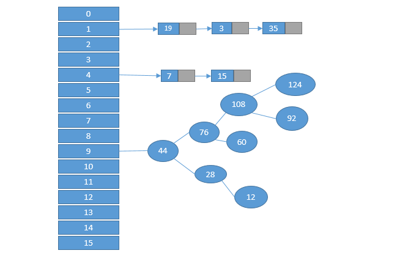

#HashMap 源码学习笔记

##1.  概述

  HashMap是我们日常开发中最常用的一个集合，HashMap最早出现在JDK 1.2中，底层是基于散列算法实现。
HashMap允许出现key为null，值为null，但只能出现一个null的key，key为null的哈希值为0。

HashMap并不保证键值对的顺序，此外，*HashMap是非线程安全类*在多线程环境下要注意。
##2.  实现原理
HashMap底层是基于散列算法实现，散列算法分为散列再探测和拉链式，Hash使用的是拉链式散列算法，
并在JDK 1.8中引入了红黑树算法优化过长的链表。结构示意图如下：

当链表长度大于TREEIFY_THRESHOLD（8）时转换为红黑树，当链表小于UNTREEIFY_THRESHOLD（6）时转换为链表。

JDK 1.7及之前，底层数据结构采用的是*数组+链表，* 在JDK 1.8变为了*数组+链表+红黑树* 

##3.   源码分析

与JDK 1.7相比，JDK 1.8对HashMap进行了一些优化，比如引入红黑树解决过长链表的效率问题。重写resize方法，移除alternative hashing相关方法，避免重新计算hash等。

* 构造方法
HashMap的构造方法有四个：
```
    public HashMap(int initialCapacity, float loadFactor) {
        if (initialCapacity < 0)
            throw new IllegalArgumentException("Illegal initial capacity: " +
                                               initialCapacity);
        if (initialCapacity > MAXIMUM_CAPACITY)
            initialCapacity = MAXIMUM_CAPACITY;
        if (loadFactor <= 0 || Float.isNaN(loadFactor))
            throw new IllegalArgumentException("Illegal load factor: " +
                                               loadFactor);
        this.loadFactor = loadFactor;
        this.threshold = tableSizeFor(initialCapacity);
    }

    public HashMap(int initialCapacity) {
        this(initialCapacity, DEFAULT_LOAD_FACTOR);
    }
    
     public HashMap() {
         this.loadFactor = DEFAULT_LOAD_FACTOR; // all other fields defaulted
     }
     
     public HashMap(Map<? extends K, ? extends V> m) {
         this.loadFactor = DEFAULT_LOAD_FACTOR;
         putMapEntries(m, false);
     }
```

一般情况下，我们会使用无参数构造方法创建HashMap,但当我们有特殊要求是，
有时候默认值会达不到我们的要求，我们就需要手动调参。这时候需要使用第一个构造方法，下面我们来看一下这两个参数：
一个是初始容量 initialCapacity，一个是负载因子 loadFactor，设定这两个参数，可以计算得出阙值大小。这三个参数的作用如下表：

|名称|默认值|用途|
|----|----|----|
|initialCapacity|1<<4(16)|HashMap 初始容量|
|loadFactor|0.75|负载因子|
|threshold|capacity * loadFactor(12)|当前 HashMap 所能容纳键值对数量的最大值，超过这个值，则需扩容|

默认情况下HashMap的初始容量是16，负载因子是0.75， 阙值应该是threshold = capacity * loadFactor，但是构造方法1中，这个
值却是通过tableSizeFor()方法得来的，源码如下：
```
    /**
     * Returns a power of two size for the given target capacity.
     */
    static final int tableSizeFor(int cap) {
        int n = cap - 1;
        n |= n >>> 1;
        n |= n >>> 2;
        n |= n >>> 4;
        n |= n >>> 8;
        n |= n >>> 16;
        return (n < 0) ? 1 : (n >= MAXIMUM_CAPACITY) ? MAXIMUM_CAPACITY : n + 1;
    }
```

上面这段代码总结出来就是一句话：找到大于后等于cap最小的2的幂。

对HashMap来说，负载因子是一个很重要的参数。负载因子调小，HashMap容纳的键值对就少，扩容时，重新将键值对存储到新的桶数组，键与键之间产生的碰撞下降，链表长度变短，此时，HashMap
的增删改查效率将会变高，但是会频繁的触发扩容，典型的空间换时间。如果调大负载因子（可以大于1），HashMap所容纳的键值对变多，空间利用率高，相应的链表就越大，效率随之变小，属于拿时间换空间。

* 查找
HashMap查找较简单，先确定键值对对应的桶的位置，然后在对链表或者红黑树进行查找。源码如下：
```
    public V get(Object key) {
        Node<K,V> e;
        return (e = getNode(hash(key), key)) == null ? null : e.value;
    }
    
    final Node<K,V> getNode(int hash, Object key) {
        Node<K,V>[] tab; Node<K,V> first, e; int n; K k;
        //1.确定元素在桶的位置
        if ((tab = table) != null && (n = tab.length) > 0 &&
            (first = tab[(n - 1) & hash]) != null) {
            if (first.hash == hash && // always check first node
                ((k = first.key) == key || (key != null && key.equals(k))))
                return first;
            if ((e = first.next) != null) {
                //如果first是TreeNode类型，则调用红黑树查找方法。
                if (first instanceof TreeNode)
                    return ((TreeNode<K,V>)first).getTreeNode(hash, key);
                do {
                //否则对链表进行查找
                    if (e.hash == hash &&
                        ((k = e.key) == key || (key != null && key.equals(k))))
                        return e;
                } while ((e = e.next) != null);
            }
        }
        return null;
    }
```
我们先看第一步，确定元素在桶的位置：

```
first = tab[(n - 1) & hash]
```
这里通过(n - 1)& hash即可算出桶的在桶数组中的位置，可能有的朋友不太明白这里为什么这么做，这里简单解释一下。HashMap 中桶数组的大小 length 总是2的幂，此时，(n - 1) & hash 等价于对 length 取余。但取余的计算效率没有位运算高，所以(n - 1) & hash也是一个小的优化。

我们来看一下hash的计算方法：
```
    static final int hash(Object key) {
        int h;
        return (key == null) ? 0 : (h = key.hashCode()) ^ (h >>> 16);
    }
```
这是要key的hashCode高16位和低16位异或运算，让高16位参与运算，增加hash的复杂度，进而让key分布更均匀。
* 遍历
遍历HashMap一般用下面的方式：
```
for (Object key:map.keySet()){
    do something
}
```
或：
```
for(HashMap.Entry entry:map.entrySet()){
    do something
}
```
HashMap的遍历，首先是遍历桶数组，找到包含链表节点引用的数组，随后由nextNode方法遍历该桶指向的链表，
遍历完该链表后，寻找下一个不为空的桶数组，知道遍历完所有的桶数组为止。

* 插入
先说一下HashMap插入的流程，第一部是先定位要插入的键属于哪个桶，定位到桶之后，在判断桶是否为null，如果为null，则直接插入，如果不为null，则将键值插入到链表的最后一个位置，或更新键值对。
首先看一下源码:
```
    public V put(K key, V value) {
        return putVal(hash(key), key, value, false, true);
    }
    final V putVal(int hash, K key, V value, boolean onlyIfAbsent,
                       boolean evict) {
        Node<K,V>[] tab; Node<K,V> p; int n, i;
         // 初始化桶数组 table，新建时并不初始化数组，只有在第一次put的时候，在初始化
        if ((tab = table) == null || (n = tab.length) == 0)
            n = (tab = resize()).length;
        //如果桶中不包含键值对节点的引用，则将新节点的引用存入桶即可
        if ((p = tab[i = (n - 1) & hash]) == null)
            tab[i] = newNode(hash, key, value, null);
        else {
            Node<K,V> e; K k;
            // 如果键的值以及节点 hash 等于链表中的第一个键值对节点时，则将 e 指向该键值对
            if (p.hash == hash &&
                ((k = p.key) == key || (key != null && key.equals(k))))
                e = p;
            // 如果桶中的引用类型为 TreeNode，则调用红黑树的插入方法
            else if (p instanceof TreeNode)
                e = ((TreeNode<K,V>)p).putTreeVal(this, tab, hash, key, value);
            else {
                // 对链表进行遍历，并统计链表长度
                for (int binCount = 0; ; ++binCount) {
                // 如果不存在当前需要插入的节点，
                    if ((e = p.next) == null) {
                        //则新建一个节点插入链表的最后
                        p.next = newNode(hash, key, value, null);
                        // 如果链表长度大于或等于树化阈值，则进行树化操作
                        if (binCount >= TREEIFY_THRESHOLD - 1) // -1 for 1st
                            treeifyBin(tab, hash);
                        break;
                    }
                    //如果该条件成立，表示当前链表包含要插入的键值对，终止遍历
                    if (e.hash == hash &&
                        ((k = e.key) == key || (key != null && key.equals(k))))
                        break;
                    p = e;
                }
            }
            // 判断要插入的键值对是否存在 HashMap 中
            if (e != null) { // existing mapping for key
                V oldValue = e.value;
                // onlyIfAbsent 表示是否仅在 oldValue 为 null 的情况下更新键值对的值
                if (!onlyIfAbsent || oldValue == null)
                    e.value = value;
                afterNodeAccess(e);
                return oldValue;
            }
        }
        ++modCount;
        // 键值对数量超过阈值时，则进行扩容
        if (++size > threshold)
            resize();
        afterNodeInsertion(evict);
        return null;
    }
```

putVal()方法主要做了那么几件事：
1.  当桶数组 table 为空时，通过扩容的方式初始化 table
2.  查找要插入的键值对是否已经存在，存在的话根据条件判断是否用新值替换旧值
3.  如果不存在，则将键值对链入链表中，并根据链表长度决定是否将链表转为红黑树
4.  判断键值对数量是否大于阈值，大于的话则进行扩容操作

* 扩容机制

在 HashMap 中，桶数组的长度均是2的幂，阈值大小为桶数组长度与负载因子的乘积。当 HashMap 中的键值对数量超过阈值时，进行扩容。

HashMap 的扩容机制与其他变长集合的套路不太一样，HashMap 按当前桶数组长度的2倍进行扩容，阈值也变为原来的2倍（如果计算过程中，阈值溢出归零，则按阈值公式重新计算）。扩容之后，要重新计算键值对的位置，并把它们移动到合适的位置上去。

```
final Node<K,V>[] resize() {
    Node<K,V>[] oldTab = table;
    int oldCap = (oldTab == null) ? 0 : oldTab.length;
    int oldThr = threshold;
    int newCap, newThr = 0;
    // 如果 table 不为空，表明已经初始化过了
    if (oldCap > 0) {
        // 当 table 容量超过容量最大值，则不再扩容
        if (oldCap >= MAXIMUM_CAPACITY) {
            threshold = Integer.MAX_VALUE;
            return oldTab;
        } 
        // 按旧容量和阈值的2倍计算新容量和阈值的大小
        else if ((newCap = oldCap << 1) < MAXIMUM_CAPACITY &&
                 oldCap >= DEFAULT_INITIAL_CAPACITY)
            newThr = oldThr << 1; // double threshold
    } else if (oldThr > 0) // initial capacity was placed in threshold
        /*
         * 初始化时，将 threshold 的值赋值给 newCap，
         * HashMap 使用 threshold 变量暂时保存 initialCapacity 参数的值
         */ 
        newCap = oldThr;
    else {               // zero initial threshold signifies using defaults
        /*
         * 调用无参构造方法时，桶数组容量为默认容量，
         * 阈值为默认容量与默认负载因子乘积
         */
        newCap = DEFAULT_INITIAL_CAPACITY;
        newThr = (int)(DEFAULT_LOAD_FACTOR * DEFAULT_INITIAL_CAPACITY);
    }
    
    // newThr 为 0 时，按阈值计算公式进行计算
    if (newThr == 0) {
        float ft = (float)newCap * loadFactor;
        newThr = (newCap < MAXIMUM_CAPACITY && ft < (float)MAXIMUM_CAPACITY ?
                  (int)ft : Integer.MAX_VALUE);
    }
    threshold = newThr;
    // 创建新的桶数组，桶数组的初始化也是在这里完成的
    Node<K,V>[] newTab = (Node<K,V>[])new Node[newCap];
    table = newTab;
    // 下面这段就是把原来table里面的值全部搬到新的table里面
    if (oldTab != null) {
        // 如果旧的桶数组不为空，则遍历桶数组，并将键值对映射到新的桶数组中
        for (int j = 0; j < oldCap; ++j) {
            Node<K,V> e;
            if ((e = oldTab[j]) != null) {
             // 这里注意, table中存放的只是Node的引用, 这里将oldTab[j]=null只是清除旧表的引用, 但是真正的node节点还在, 只是现在由e指向它
                oldTab[j] = null;
                // 如果桶里面只有一个元素，就直接将它放到新表的目标位置
                if (e.next == null)
                    newTab[e.hash & (newCap - 1)] = e;
                else if (e instanceof TreeNode)
                    // 重新映射时，需要对红黑树进行拆分
                    ((TreeNode<K,V>)e).split(this, newTab, j, oldCap);
                else { // preserve order
                /*先说下hashmap的索引位置的算法——e.hash & (cap - 1)
                key的hash值和容量减一得到的值做&的操作，得到的值则为
                该key所在的索引位置。
                hashmap扩容的大小为2倍，之前大小为16，扩容后为32，
                根据hashmap的索引位置的计算方法，扩容后的元素的索引位置只有两种结果——要么不变
                要么是旧索引+oldCap（旧索引位置加上旧的额table容量，则为新的索引位置）。
                resize()方法内定义了loHead、loTail、hiHead、hiTail。我们可以把扩容后的容量大小分成low和high，
                low可以理解为旧table，high可以理解为新扩充的那一部分。
                loHead和loTail的意思就分别是low的头部和尾部；hiHead和hiTail的意思分别是high的头部和尾部。
                 (e.hash & oldCap) == 0为true的话，则可以理解为e这个元素的索引位置是不变                              
                 的。假如e.hash为14，oldCap为16。16是2的次幂，所以16的二进制除了高位为1，其他位都为0，和14做&操作
                结果肯定为0。如果 (e.hash & oldCap) == 0为false的话，则e这个元素
                的索引位置肯定是发生了变化，变为了旧位置+oldCap。例如e.hash为16，oldCap为16，newCap则为32，
                e.hash&oldCap==0为false，e.hash&(oldCap-1)的值为0，但是e.hash&(newCap-1)的值为16。
                扩容的同时解决了hash冲突，也很快的计算出新的索引位置。
                */
                    Node<K,V> loHead = null, loTail = null;
                    Node<K,V> hiHead = null, hiTail = null;
                    Node<K,V> next;
                    // 遍历链表，并将链表节点按原顺序进行分组
                    do {
                        next = e.next;
                        if ((e.hash & oldCap) == 0) {
                            if (loTail == null)
                                loHead = e;
                            else
                                loTail.next = e;
                            loTail = e;
                        }
                        else {
                            if (hiTail == null)
                                hiHead = e;
                            else
                                hiTail.next = e;
                            hiTail = e;
                        }
                    } while ((e = next) != null);
                    // 将分组后的链表映射到新桶中
                    if (loTail != null) {
                        loTail.next = null;
                        newTab[j] = loHead;
                    }
                    if (hiTail != null) {
                        hiTail.next = null;
                        newTab[j + oldCap] = hiHead;
                    }
                }
            }
        }
    }
    return newTab;
}
```

JDK 1.7 为了防止因 hash 碰撞引发的拒绝服务攻击，在计算 hash 过程中引入随机种子。以增强 hash 的随机性，使得键值对均匀分布在桶数组中。在扩容过程中，相关方法会根据容量判断是否需要生成新的随机种子，并重新计算所有节点的 hash。而在 JDK 1.8 中，则通过引入红黑树替代了该种方式。从而避免了多次计算 hash 的操作，提高了扩容效率。

* 删除

HashMap 的删除需三个步骤即可完成，第一步是定位桶位置，第二步遍历链表并找到键值相等的节点，第三步删除节点
```
public V remove(Object key) {
    Node<K,V> e;
    return (e = removeNode(hash(key), key, null, false, true)) == null ?
        null : e.value;
}

final Node<K,V> removeNode(int hash, Object key, Object value,
                           boolean matchValue, boolean movable) {
    Node<K,V>[] tab; Node<K,V> p; int n, index;
    if ((tab = table) != null && (n = tab.length) > 0 &&
        // 1. 定位桶位置
        (p = tab[index = (n - 1) & hash]) != null) {
        Node<K,V> node = null, e; K k; V v;
        // 如果键的值与链表第一个节点相等，则将 node 指向该节点
        if (p.hash == hash &&
            ((k = p.key) == key || (key != null && key.equals(k))))
            node = p;
        else if ((e = p.next) != null) {  
            // 如果是 TreeNode 类型，调用红黑树的查找逻辑定位待删除节点
            if (p instanceof TreeNode)
                node = ((TreeNode<K,V>)p).getTreeNode(hash, key);
            else {
                // 2. 遍历链表，找到待删除节点
                do {
                    if (e.hash == hash &&
                        ((k = e.key) == key ||
                         (key != null && key.equals(k)))) {
                        node = e;
                        break;
                    }
                    p = e;
                } while ((e = e.next) != null);
            }
        }
        
        // 3. 删除节点，并修复链表或红黑树
        if (node != null && (!matchValue || (v = node.value) == value ||
                             (value != null && value.equals(v)))) {
            if (node instanceof TreeNode)
                ((TreeNode<K,V>)node).removeTreeNode(this, tab, movable);
            else if (node == p)
                tab[index] = node.next;
            else
                p.next = node.next;
            ++modCount;
            --size;
            afterNodeRemoval(node);
            return node;
        }
    }
    return null;
}
```

##4.总结
JDK 1.8 HashMap底层结构采用的是**数组+链表+红黑树**组成的

HashMap是非线程安全的

HashMap 新建的时候不初始化，只有在第一次put的时候才初始化

HashMap 在新建的时候会触发扩容和大小达到了阙值触发扩容

目前就想到这些，以后再补充